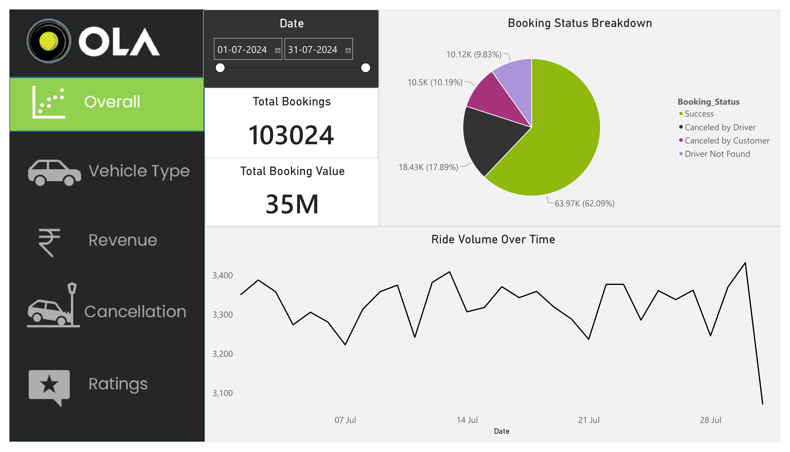
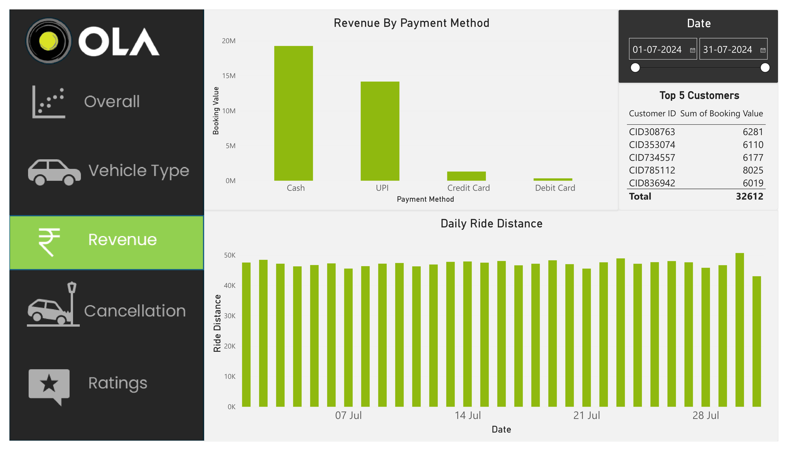
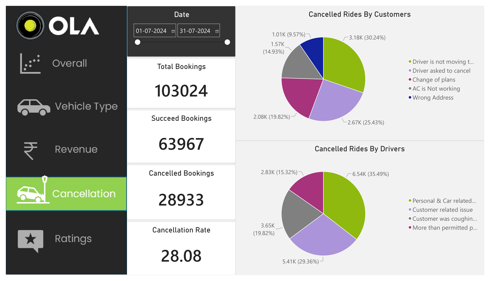

# Ola Booking Analysis
## Project Overview
This is my first Data Analytics project, where I analyzed Ola booking data using Excel, SQL, and Power BI.
The main objective of this project is to explore booking performance, vehicle types, payment methods, cancellations, customer behavior, and ratings through SQL analysis and an interactive Power BI dashboard.
## Tools Used
- Microsoft Excel
- SQL
- Microsoft Power BI
## Dataset
The dataset contains Ola booking records for July 2024.
It includes information such as:
- Booking Date and Time
- Booking ID
- Booking Status
- Customer ID
- Vehicle Type
- Pickup and Drop Locations
- Booking Value
- Payment Method
- Ride Distance
- Driver Ratings
- Customer Ratings
- Customer Cancellation Information
- Driver Cancellation Information
- Incomplete Ride Information
## SQL Analysis
I used SQL to answer 10 analytical questions related to the booking data.
The analysis includes:
1. Retrieve all successful bookings
2. Find the average ride distance for each vehicle type
3. Calculate the total number of customer-cancelled rides
4. Identify the top 5 customers by number of rides
5. Find rides cancelled by drivers due to personal and car-related issues
6. Find the maximum and minimum driver ratings for Prime Sedan
7. Retrieve bookings where payment was made using UPI
8. Calculate average customer ratings by vehicle type
9. Calculate the total booking value of successful rides
10. Retrieve incomplete rides along with their reasons
SQL views were also created for the analysis.
## Power BI Dashboard
I created an interactive Power BI dashboard to analyze different aspects of the booking data.
The dashboard includes:
- Ride Volume Over Time
- Booking Status Breakdown
- Vehicle Type Analysis
- Revenue by Payment Method
- Top 5 Customers by Booking Value
- Ride Distance Analysis
- Customer Cancellation Reasons
- Driver Cancellation Reasons
- Driver Ratings
- Customer Ratings
The Power BI dashboard includes filters/slicers that allow the data to be explored interactively.
## Key Metrics
- Total Bookings: 103,024
- Successful Bookings: 63,967
- Successful Booking Rate: 62.09%
- Customer Cancellation Rate: 10.19%
- Driver Cancellation Rate: 17.89%
- Driver Not Found: 9.83%
- Total Booking Value: Approximately 35M
## Key Observations
- Successful bookings account for approximately 62% of total bookings.
- Customer cancellations account for approximately 10% of total bookings.
- Driver cancellations account for approximately 18% of total bookings.
- Driver-not-found bookings account for approximately 10% of total bookings.
- Payment methods were analyzed to compare booking value across different payment types.
- Vehicle types were compared based on ride distance and booking-related metrics.
- Driver and customer ratings were analyzed to understand rating patterns.
## Project Workflow
1. Reviewed the booking dataset in Excel.
2. Used SQL to perform analysis and answer business-related questions.
3. Created SQL views for different analysis requirements.
4. Built an interactive Power BI dashboard.
5. Used KPIs, charts, filters, and visualizations to present the analysis.
6. Reviewed the results to identify key observations from the data.
## Project Files
- `1_ola_bookings.csv` - Dataset used for the analysis
- `2_ola_booking_analysis.sql` - SQL queries and views used for analysis
- `3_ola_booking_dashboard.pdf` - Exported Power BI dashboard
- `4_overall_dashboard.png` - Overall Dashboard
- `5_revenue_analysis.png` - Revenue Analysis
- `6_cancellation_analysis.png` - Cancellation Analysis
- `README.md` - Project documentation
## Dashboard Preview
### Overall Dashboard

### Revenue Analysis

### Cancellation Analysis

## Learning Outcome
This project helped me gain practical experience in using Excel, SQL, and Power BI for data analysis and dashboard creation.
It was my first step into Data Analytics and helped me understand how data can be analyzed and presented through SQL queries and interactive dashboards.
---
## Disclaimer
This is a learning/project dataset created for data analytics practice and portfolio purposes.
The project is not based on confidential or proprietary Ola company data.
